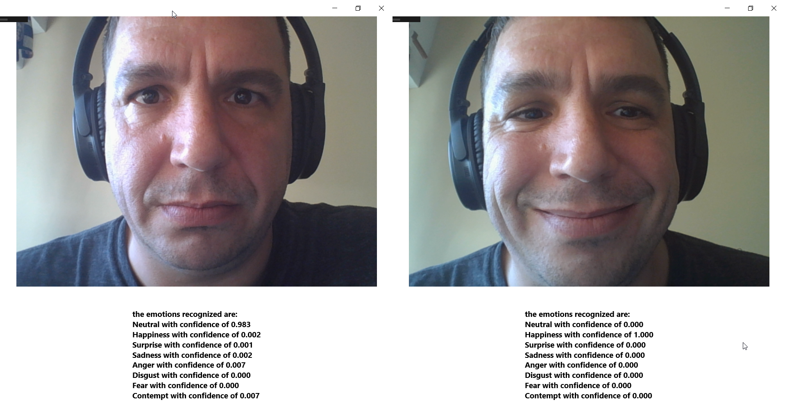

# Emotion Recogition Sample

A simple UWP application that uses a pretrained machine learning model called FERPlus to recognize the predominant emotion in an image taken directly from the camera. 

This sample demonstrates the use of generic Windows.AI.MachineLearning.Preview API to load a model, bind an input image and an output tensor, and evaluate a binding.

## Build the sample

1. Download and extract the samples ZIP or clone this repository.

2. Start Microsoft Visual Studio 2017 Preview 1.0 and select **File** \> **Open** \> **Project/Solution**.

3. Starting in the folder where you unzipped/cloned the samples, go to the
   folder for this specific sample. Double-click the Visual Studio project file (.csproj) file.

4. Press Ctrl+Shift+B, or select **Build** \> **Build Solution**.

## Run the sample

- To debug the sample and then run it, press F5 or select Debug >  Start Debugging. To run the sample without debugging, press Ctrl+F5 or selectDebug > Start Without Debugging.

## Sample notes

> For best results, make sure your face is close to the camera when you take the picture.

## Screenshots

